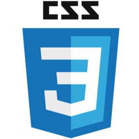

### Hi there, I'm Manzoor Hussain 

---

 

- 🌱 I’m currently learning Data Science.
- 🔭 I’m currently working as an Intern at <a href="https://www.sestek.com/" target="_blank">Sestek </a>
- 👯 I’m looking to collaborate on Web Development  and AI Projects
- 😄 Pronouns: He/Him
- ⚡ Fun fact: I'm still learning.

 

### 🧰 Languages and Tools:

 
 

<!--   Stats -->
### 📊 GitHub Stats:

 
  
<!--   Top Languages Using -->
### 👨‍💻 Top Languages Used:

<!--   GitHub stats graph -->
### 📈 GitHub Activity Graph:
 

   
 
 

 
  

  

  <h3><b> Connect With Me On  </b></h3>
  

 &nbsp;&nbsp;
 &nbsp;&nbsp;
 &nbsp;&nbsp;
 &nbsp;&nbsp;
 &nbsp;&nbsp;

  
 
  

  <h3><b>📍 Profile Visitor Count</b></h3>

    
<!-- retro visitor counter -->  

   
    

   
  
  
